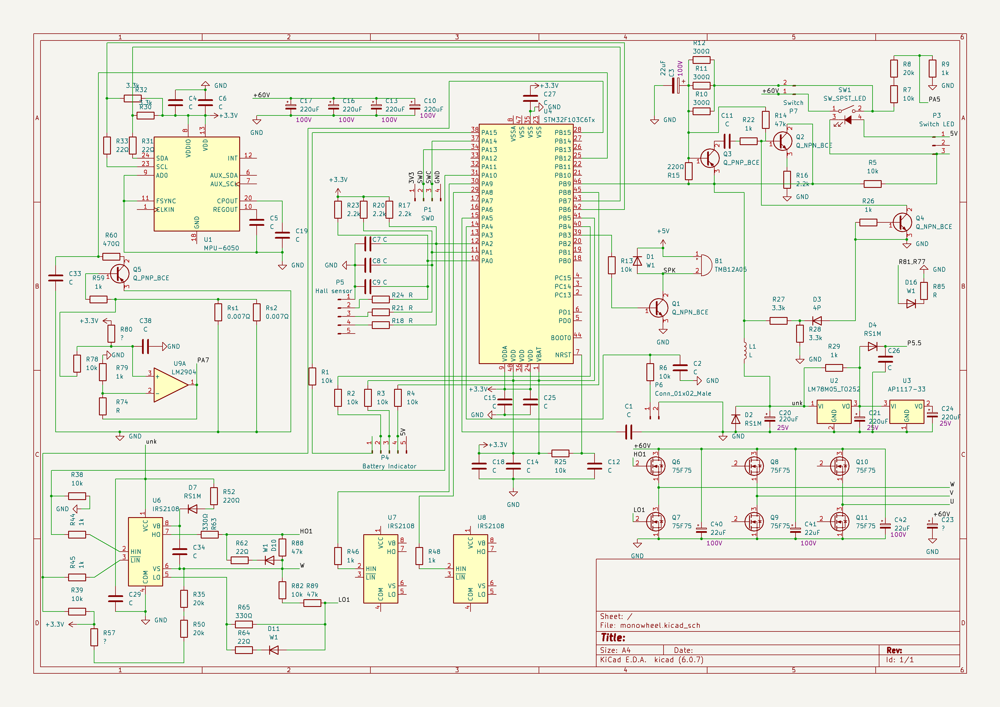

# Sologear G3-15 Electric Unicycle
Sologear G3-15 Electric Unicycle reverse engineering to reuse motherboard with custom firmware.
Schematics of other generic cheaper electric unicycles (monowheels) should be same/similar. Let us know in the issues. You can also comment in Bill of materials.

[Bill of materials](https://docs.google.com/spreadsheets/d/1EM--kQIaX84T2JI6LrDOyGJttcWCDYOLsfqfUfqGejQ/edit?usp=sharing)

|Step|1   |2   |3   |4   |5   |6   |
|----|----|----|----|----|----|----|
|High|A   |B   |B   |C   |C   |A   |
|Low |C   |C   |A   |A   |B   |B   |
|    |H1L3|H2L3|H2L1|H3L1|H3L2|H1L2|

https://www.digikey.be/nl/articles/what-is-the-most-effective-way-to-commutate-a-bldc-motor
| |U  |V  |W  |Step|
|-|---|---|---|----|
|1|+  |-  |off|6   |
|2|+  |off|-  |1   |
|3|off|+  |-  |2   |
|4|-  |+  |off|3   |
|5|-  |off|+  |4   |
|6|off|-  |+  |5   |
| |A  |B  |C  |    |

#### Connections
|STM32F103C8T6|MPU 6050|Comment         |
|-------------|--------|----------------|
|PB7          |SDA     |Via resistor R31|
|PB6          |SCL     |Via resistor R33|

|STM32F103C8T6|SWD|
|-------------|---|
|PA14         |SWC|
|PA13         |SWD|
|             |3V3|
|             |GND|

|STM32F103C8T6|P4 Battery Indicator|Color |Comment        |
|-------------|--------------------|------|---------------|
|PA15         |1                   |Black |Via resistor R1|
|PB4          |2                   |Blue  |Via resistor R2|
|PB5          |3                   |Yellow|Via resistor R3|
|PB8          |4                   |Green |Via resistor R4|
|             |5                   |Red   |+5V            |

|STM32F103C8T6|Hall sensor|Color |Comment        |
|-------------|-----------|------|---------------|
|             |1          |Black |GND            |
|PA0          |2          |Blue  |               |
|PA1          |3          |Yellow|               |
|PA2          |4          |Green |               |
|             |5          |Red   |               |

Half-Bridge Driver connections
|STM32F103C8T6|IRS2108|
|-------------|-------|
|PB10         |HIN1    |
|PB09         |HIN2    |
|PB08         |HIN3    |
|PB15         |LIN1    |
|PB14         |LIN2    |
|PB13         |LIN3    |

### Firmware
Existing firmware was unprotected and could be read using STM-Link V2. Soldering headers was a bit difficult as pin holes were already filled with solder.

### Components
STM32F103C8T6\
InvenSense MPU 6050\
6 MOSFET ST P75NF75&\
[IRS2108 Half-bridge Driver](https://www.infineon.com/dgdl/irs2108.pdf?fileId=5546d462533600a40153567649d627a8)

### Battery
59.2V/4.4Ah 260Wh SAMSUNG/22PM\
Hy-LYX-1602B-22PM-144900042

### Motor
CST e-BIKE PRO Li-ion Electronic\
14AMK1512615052\
XINAOMA

### Useful software
STM32 ST-LINK Utility\
Ghidra with SVD-Loader

### Connections
|Marking on board|Connections|Connected                    |
|----------------|-----------|-----------------------------|
|P2              |2          |5v SPK Unpopulated           |
|P3              |3          |2p connected to switch LED   |
|P4              |5          |2mm: battery level           |
|P5              |5          |2.5mm: hall effect sensor    |
|P6              |2          |Disconnected                 |
|P7              |2          |Switch                       |
#### Switch
|Marking on board|Color|Switch|
|----------------|-----|------|
|P3              |Red  |      |
|P3              |Black|      |
|P7              |Red  |      |
|P7              |White|Center|

#### Charging port
Red
Black
Connected to battery
#### Motor connection
|Color |Marking on board|
|------|----------------|
|Yellow|Y?              |
|Green |V               |
|Blue  |W               |

???
GND
3.3V
